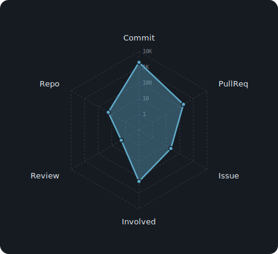
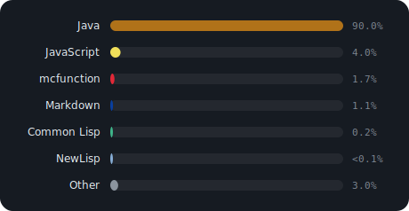

[](https://git.io/typing-svg)  
僕、学生なんでね命名が終わってるとかコードが汚いとかは見逃してほしいですね  
まだ趣味の域を超えてないので許してほしいのだ  

<!-- 自作の GitHub 統計チャート（このリポジトリの Action が charts/ を12時間ごとに自動生成）-->
  
  
  

<!-- 以下は補助（自作チャートを優先表示） -->
  

  

[](https://www.buymeacoffee.com/hrmcngs)


---

### 他のリポジトリに同じチャートを入れる

任意のリポジトリの Codespaces ターミナル（または手元の git クローン）で以下を貼り付けるだけ:

```sh
curl -fsSL https://raw.githubusercontent.com/hrmcngs/hrmcngs/main/bootstrap.sh | bash
```

- `git remote (origin)` から GitHub ユーザー名を自動検出（`GHS_USER=foo` で上書き可）
- `scripts/gen-charts.js` / `src/js/charts.js` / `.github/workflows/update-charts.yml` を配置
- その場で 1 回 SVG を生成し、以降は Actions が 12 時間ごとに自動更新
